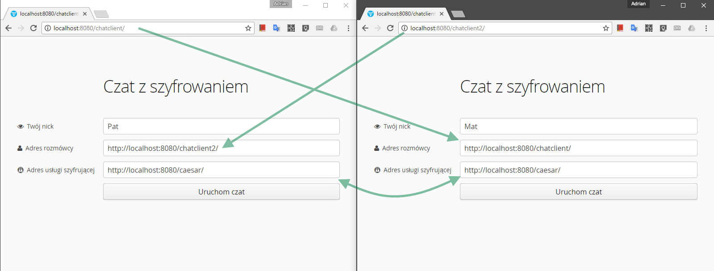
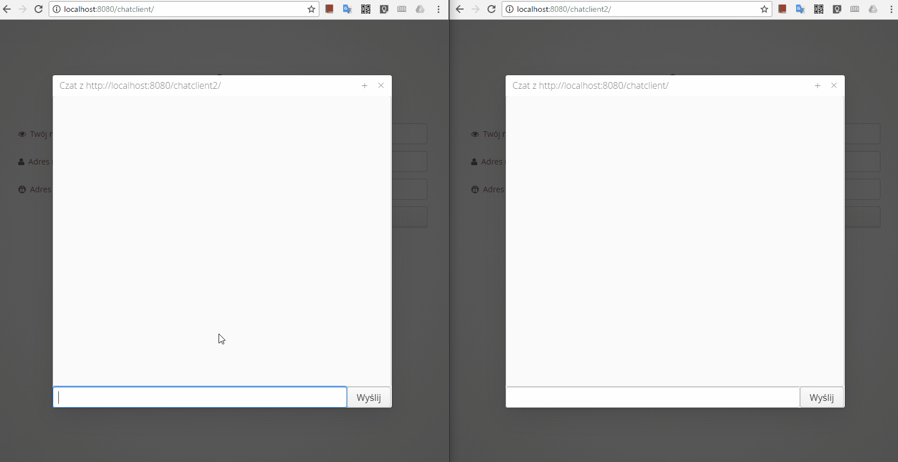
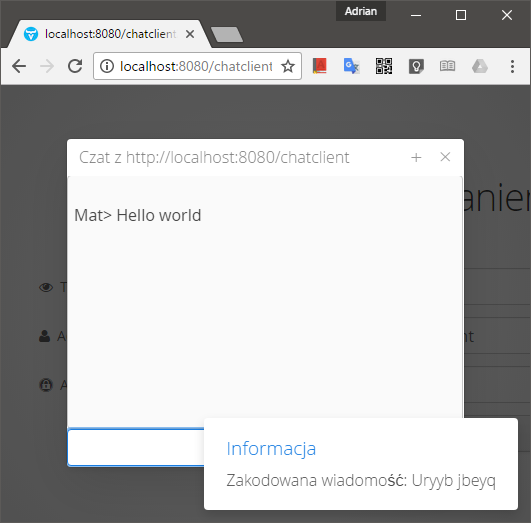
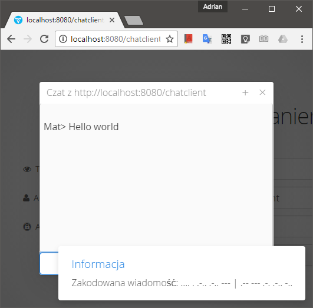
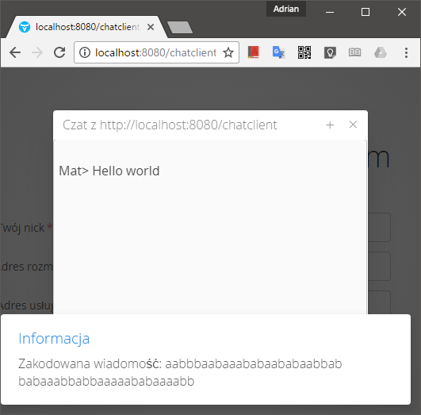

# EncryptedChat

## Wstęp
**EncryptedChat** jest aplikacją umożliwiającą szyfrowaną komunikację pomiędzy użytkownikami, zaprojektowaną by działać w środowisku rozproszonym.  

Program został stworzony na potrzeby projektu z przedmiotu Programowanie Systemów Rozproszonych.
Jego autorami są Adrian Michalski i Kamil Maj.

Archiwa .war ze skompilowanymi źródłami gotowymi do umieszczenia na serwerze aplikacji dostepne są w katalogu **release**.
- [Klient](release/chatclient.war)
- [Usługa szyfru Cezara](release/caesar.war)
- [Usługa szyfru Morse'a](release/morse.war)
- [Usługa szyfru Bacona](release/bacon.war)

### Środowisko uruchomieniowe
Aplikacja do działania wymaga serwera aplikacji WildFly. Najprostszym sposobem uruchomienia gotowego serwera jest pobranie i zainstalowanie gotowego rozwiązania [Bitnami WildFly stack](https://bitnami.com/stack/wildfly).

### Uruchamianie aplikacji na serwerze
1. Budowanie archiwum .war (krok można pominąć w przypadku pobrania gotowych plików .war powyżej)
 - przejdź do katalogu z klientem, bądź wybraną usługą szyfrującą (katalog z plikiem pom.xml)
 - uruchom polecenie `mvn clean package`
 - plik .war powinien pojawić się w katalogu `target`
2. Umieszczanie archiwów .war na serwerze
 - przejdź do katalogu `bin` w głównym katalogu serwera WildFly
 - połącz się z linią komend JBoss poprzez uruchomienie polecenia `jboss-cli.bat --connect`
 - po ustanowieniu połączenia do jboss-cli wpisz `deploy C:\sciezka\do\xxx.war`
 - usługa będzie dostępna po adresem `http://localhost:8080/xxx`, gdzie `xxx` jest nazwą archiwum .war usługi (można uruchomić kilka usług tego samego typu zmieniając nazwy archiwów)

## Architektura
W architekturze aplikacji wyróżniamy klienta oraz usługę szyfrującą. Są one niezależne od siebie, dzięki temu mogą działać na pojedynczej lub kilku maszynach oraz skalować się w poziomie.

### Minimalna konfiguracja 
Podstawowa konfiguracja składa się z 2 instancji klienta oraz 1 usługi szyfrującej.

**Schemat działania**:
1. Użytkownik A wpisuje wiadomość oraz klika przycisk "Wyślij"
2. Klient zwraca się do usługi szyfrującej z prośbą o zaszyfrowanie wiadomości
3. Usługa szyfrująca zwraca zaszyfrowaną wiadomość do klienta
4. Klient wysyła zaszyfrowaną wiadomość do drugiego rozmówcy
5. Rozmówca odbiera wiadomość i zwraca się do usługi szyfrującej z prośbą o jej rozszyfrowanie
6. Usługa szyfrująca zwraca rozszyfrowaną wiadomość do rozmówcy
7. Rozszyfrowana wiadomość wyświetlana jest na ekranie Użytkownika B

### Konfiguracja z Load Balancerem
Konfiguracja ta zakłada połączenie z pośrednictwem usługi przekierowującej ruch do jednej z kilku instancji usługi szyfrującej. Pozwala to na poziome skalowanie usługi, dzięki czemu eliminuje problemy z ograniczeniem wydajności pojedynczej maszyny, a w razie awarii jednej instancji, kolejne przejmują jej zadanie.

### Konfiguracja typu czat publiczny
W tej konfiguracji użytkownik nie podaje adresu pojedynczego rozmówcy, lecz adres na którym działa aplikacja pokoju. Podczas połączenia z pokojem następuje wpisanie użytkownika do rejestru. Po dotarciu wiadomości do pokoju rozsyłana jest ona do wszystkich użytkowników w rejestrze.

## Klient (moduł client)

### Opis
Aplikacja klienta udostępnia użytkownikowi interfejs graficzny dostępny poprzez przeglądarkę internetową. Napisana została w oparciu o framework Vaadin w wersji 8.

### Obsługa
Po uruchomieniu aplikacji należy wpisać nick (nazwę użytkownika, która wyświetlana będzie wraz z wysłaną wiadomością), adres pod którym znajduje się aplikacja klienta z której korzysta drugi rozmówca oraz adres pod którym znajduje się usługa szyfrująca.

**Przykład**:  
- Po obu stronach ekranu widoczne są 2 aplikacje klienta dziąłające pod innymi adresami.
- Po ustawieniu nicków rozmówcy ustawiają swoje adresy "na krzyż" - tj. użytkownik **A** ustawia adres użytkownika **B**, a użytkownik **B** ustawia adres użytkownika **A**.
- Obaj użytkownicy powinni używać usługi szyfrującej tego samego typu, w przeciwnym razie. Wyjątkiem od tej sytuacji może być użycie usługi tłumacza zamiast szyfrującej. W tym wypadku jeden rozmówca ustawia przykładowo usługę tłumaczącą z języka polskiego na język angielski, a drugi rozmówca usługe tłumaczącą z języka angielskiego na język polski.
- Po kliknięciu "Uruchom czat" otwiera się okno czatu i można prowadzić rozmowę.

### Technikalia

#### Endpoint do przyjmowania wiadomości
Za przyjmowanie wiadomości z zewnątrz odpowiada klasa `MessageEndpoint`.
Wystawia ona endpoint pod ścieżką `/api`.
Request **GET** na ten adres przyjmuje 2 parametry:
- **user** - z nazwą nadawcy wiadomości
- **message** - z zaszyfrowaną wiadomością
Po przyjęciu danych za pomocą mechanizmu Eventów z Javy EE rozsyłana jest wiadomość poprzez usługę `Broadcaster` do wszystkich obserwatorów tego zdarzenia - tutaj są to wszystkie uruchomione widoki aplikacji klienta.

#### Szyfrowanie/rozszyfrowanie wiadomości
Za szyfrowanie wiadomości odpowiada klasa `CryptoServiceClient`.
Wysyła ona pod adres usługi szyfrującej prośby o:
- zaszyfrowanie widomości (ścieżka `/encoder`)
- rozszyfrowanie wiadomości (ścieżka `/decoder`)

Szyfrowanie ma miejsce po kliknięciu przycisku wyślij, a deszyfrowanie po odebraniu wiadomości z zewnątrz.

#### Wysyłanie wiadomości do drugiego rozmówcy
Za wysyłanie wiadomości na zewnątrz odpowiada klasa `ReceiverClient`. Wysyła ona zaszyfrowaną wiadomość pod adres odbiorcy na ścieżkę `/api` (opisane wyżej).

#### Interfejs użytkownika
Za wyświetlanie interfejsu użytkownika odpowiada klasa `ChatUI`. Pod rootowym adresem aplikacji udostępnia panel konfiguracji oraz otwiera okno rozmowy.

Za zawartość okienka czatu odpowiada klasa `ChatBox`. To w niej zaimplementowano połączenie interfejsu graficznego oraz klientów do szyfrowania i wysyłania wiadomości.

## Usługi szyfrujące (moduł cryptoservices)

### Opis
Usługi szyfrujące udostępniają 2 endpointy:
- `/encoder` - do szyfrowania wiadomości
- `/decoder` - do rozszyfrowania wiadomości
Na oba enpointy wysyłamy request **GET** z parametrem **message** pod którym przekazujemy wiadomość do zakodowania lub rozkodowania.

### Szyfr Cezara (moduł caesar)
Jest to jedna z najprostszych technik kodowania. Jest rodzajem szyfru podstawieniowego, gdzie każda litera zostaje zastąpiona inną, znajdującą się o stałą liczbę miejsc dalej w alfabecie. W tym przypadku wykorzystywany jest szyfr ROT13, gdzie litera przesuwana jest o 13 miejsc do przodu. 

### Szyfr Morse'a (moduł morse)
Najbardziej zaawansowany z spośród wykorzystanych sposobów kodowania. Szyfr ten, zamienia poszczególne litery alfabetu na znaki alfabetu Morse'a. 

### Szyfr Bacona (moduł bacon)
Ostatnia z wykorzystanych technik jest szyfrem, który zawiera pięcioliterowe ciągi składające się z liter "a" i "b".

